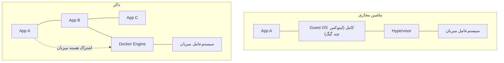
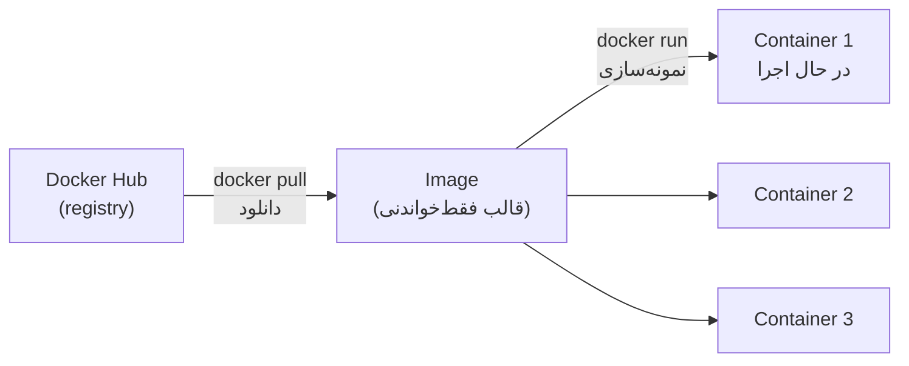

# فصل ۱ — داکر چیست و چرا همه دنیا ازش استفاده می‌کنند؟

> 🎯 **هدف این فصل:** بدون نصب هیچ‌چیز، مدل ذهنی درست رو بسازیم: کانتینر چیه، فرقش با ماشین مجازی، و سه کلمه‌ی image/container/registry که کل داکر همینه. هنوز هیچ دستوری نمی‌زنیم.

---

## ۱.۱ — مسئله: «روی سیستم من کار می‌کنه!» 😤

یک برنامه کاربردی فقط از چند فایل سورس‌کد تشکیل نشده است — بلکه به یک **محیط اجرایی کامل** نیاز دارد:

- نسخه مشخصی از ران‌تایم (مثل Node.js یا پایتون)
- پکیج‌ها و کتابخانه‌ها با نسخه‌های هماهنگ
- سرویس دیتابیس با نسخه و تنظیمات معین
- متغیرهای محیطی صحیح

به این مجموعه، **محیط و زیرساخت اجرا (Runtime Environment)** می‌گویند. چالش اصلی: محیط هر رایانه متفاوت است — سیستم توسعه‌دهنده، لپ‌تاپ سایر اعضای تیم، سرور Production، سرور تست CI/CD... تفاوت در این محیط‌ها منجر به خطاهای غیرمنتظره می‌شود.

**راهکار داکر:** برنامه را همراه با *تمام پیش‌نیازها و محیط اجرایی‌اش* بسته‌بندی کنید — همانند قرار دادن یک سرویس کامل به همراه تنظیمات در یک کانتینر ایزوله. این کانتینر در هر بستری که اجرا شود، رفتاری کاملاً یکسان و قابل پیش‌بینی خواهد داشت: یک بار بیلد کنید، در هر محیطی اجرا کنید.

## ۱.۲ — کانتینر در برابر ماشین مجازی (سوال شماره یک مصاحبه‌ها!)

هر دو «ایزوله‌سازی» می‌دن ولی از دو مسیر کاملاً متفاوت:

| | ماشین مجازی (VM) | کانتینر |
|---|---|---|
| چی رو مجازی می‌کنه؟ | کل سخت‌افزار + **یک سیستم‌عامل کامل** | فقط فضای کاربر |
| اندازه | گیگابایت‌ها | ده‌ها مگابایت |
| زمان راه‌اندازی | ده‌ها ثانیه تا دقیقه | **کمتر از یک ثانیه** ⚡ |
| مصرف رم/CPU | سنگین | ناچیز |
| چندتا روی لپ‌تاپ؟ | شاید ۲-۳ تا | ده‌ها تا |

راز سبکی کانتینر: کانتینرها **هسته‌ی (kernel) سیستم‌عامل میزبان رو به اشتراک می‌ذارن** و فقط فایل‌ها و پروسه‌های خودشون رو ایزوله می‌کنن. VM یک OS کامل میاره بالا؛ کانتینر فقط «یک اتاق» داخل OS فعلی می‌سازه.

> 💡 نکته مهم درباره ویندوز: کانتینرهای لینوکسی (که بخش اعظم دنیای کانتینرها را تشکیل می‌دهند) روی ویندوز هم اجرا می‌شوند — زیرا Docker Desktop یک لینوکس فوق‌العاده سبک را در پس‌زمینه با WSL2 مدیریت می‌کند (فصل ۲). بنابراین کانتینری که روی سیستم محلی اجرا می‌شود، دقیقاً همان لینوکس واقعی است که روی سرورها اجرا خواهد شد.

## ۱.۳ — سه کلمه طلایی: Image، Container، Registry

کل داکر در این سه مفهوم خلاصه می‌شود:

| مفهوم | چیه | شبیه به (دنیای برنامه‌نویسی) |
|---|---|---|
| **Image (ایمیج)** | بسته‌ی فقط‌خواندنی حاوی اپ + وابستگی‌ها + محیط — قالب آماده | **کلاس (Class)** |
| **Container (کانتینر)** | نمونه‌ی در حال اجرای یک ایمیج | **نمونه ساخته‌شده (Instance / Object)** |
| **Registry (رجیستری)** | پایگاه ذخیره و توزیع ایمیج‌ها (Docker Hub) | **مخازن پکیج مانند npmjs یا PyPI** |

مشابه مفهوم کلاس و شیء در شیءگرایی: از یک ایمیج `postgres:18` می‌توان ده کانتینر مستقل (ده دیتابیس کاملاً ایزوله) ایجاد کرد. ایمیج اصلی ثابت می‌ماند و کانتینرها چرخه حیات مستقل دارند.

چرخه‌ی کار نیز بسیار شبیه به پکیج‌منیجرهاست:

| مدیریت پکیج (npm/pip) | داکر (Docker) |
|---|---|
| `npm install axios` (دانلود پکیج) | `docker pull postgres:18` (دانلود ایمیج) |
| اجرای کد پکیج | `docker run postgres:18` (اجرای کانتینر) |
| `npm publish` (انتشار پکیج) | `docker push myapp:1.0` (انتشار ایمیج) |

> 🔑 درک منطق پکیج‌منیجرها به سادگی به درک داکر کمک می‌کند — تنها تفاوت این است که به جای یک کتابخانه کد، کل محیط اجرایی جابه‌جا می‌شود.

## ۱.۴ — داکر چیه دقیقاً؟

**Docker = مجموعه ابزاری استاندارد برای ساختن، اجرا و توزیع کانتینرها.** شامل:

| جزء | نقش |
|---|---|
| **Docker Engine** | موتور اجرای کانتینرها (daemon پشت صحنه + هسته داکر) |
| **Docker CLI** | ابزار خط فرمان `docker` جهت ارسال دستورات به Engine |
| **Docker Desktop** | اپ ویندوزی/مکی که Engine + GUI + WSL2 رو یک‌جا نصب می‌کنه |
| **Docker Compose** | مدیریت چند کانتینر با یک فایل YAML (فصل ۸) |
| **Docker Hub** | بزرگ‌ترین رجیستری عمومی |

مهم‌ترین نکته: **داکر اساساً مبتنی بر رابط خط فرمان (CLI) است** — `docker pull`، `docker run`، `docker ps`. تمام این دستورات از یک الگوی مشخص و منطقی پیروی می‌کنند: `docker <فعل> <موضوع> [فلگ‌ها]` — مثل `docker image pull`، `docker container ls` و غیره.

## ۱.۵ — چرا شرکت‌ها عاشقش‌ان

- **یکنواختی محیط:** dev = staging = production — همون ایمیج!
- **مستقل‌سازی تیم‌ها:** بدون نیاز به نصب دستی Postgres و Redis و Kafka روی سیستم میزبان، فقط با یک دستور اجرا می‌شوند (فصل ۸)
- **CI/CD:** پایپ‌لاین‌های گیت‌هاب اکشنز یا GitLab برنامه را داخل کانتینر تست و بیلد می‌کنند — محیطی کاملاً پاک و ایزوله در هر بار اجرا
- **دپلوی ساده:** یک ایمیج یکسان روی هر نوع سرور و ابری (فصل ۱۲)
- **مقیاس‌پذیری:** افزایش ترافیک؟ از همان ایمیج چندین کانتینر به صورت موازی بالا می‌آید

---

## ✅ جمع‌بندی فصل

- مشکل: تفاوت محیط‌ها. جواب: بسته‌بندی اپ *با محیطش* = کانتینر
- کانتینر ≠ VM: بدون OS کامل، سبک، ثانیه‌ای بالا
- **Image = کلاس، Container = آبجکت، Registry = npm برای ایمیج**
- داکر = Engine + CLI + Desktop + Compose + Hub؛ و یک ابزار استاندارد خط فرمان است
- چرا شرکت‌ها: یکنواختی، ایزوله‌سازی، دپلوی، مقیاس

## 📝 تمرین فصل ۱

1. فرق image و container رو با analogi کلاس/آبجکت تو یک جمله بگو.
2. چرا کانتینر سبک‌تر از VM است؟ (در یک جمله: کی kernel رو شریک می‌شه؟)
3. جدول معادل‌ها رو کامل کن: `docker pull` ↔ `npm ?`، `docker run` ↔ `?`، `docker push` ↔ `?`
4. یک موقعیت واقعی از توسعه نرم‌افزار بنویسید که داکر می‌تواند از بروز ناهماهنگی نسخه‌ها جلوگیری کند (مثل تداخل نسخه‌های مختلف پایگاه داده یا پکیج‌های ناسازگار).

جواب‌ها

3. `docker pull` ↔ `npm install`؛ `docker run` ↔ اجرای برنامه‌ی نصب‌شده (مثل `npx`)؛ `docker push` ↔ `npm publish`.

➡️ **فصل بعد:** نصب Docker Desktop روی ویندوز و اولین hello-world دنیای کانتینرها!
