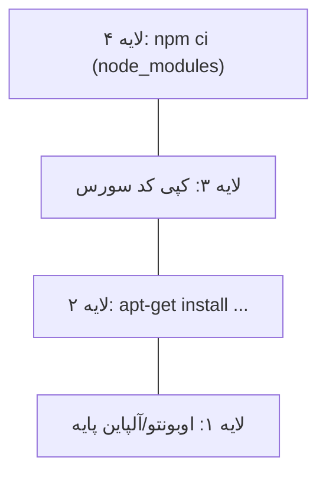

# فصل ۴ — ایمیج‌ها: تگ‌ها، لایه‌ها و Docker Hub

> 🎯 **هدف:** ایمیج رو نه «یک فایل دانلودی»، بلکه یک **پشته‌ی لایه‌ای** بفهمی — چون همه‌ی جادوی داکر (سرعت build، کش، اشتراک فضا) از همین لایه‌ها میاد. Plus: کار با Docker Hub مثل npm.

---

## ۴.۱ — ایمیج از کجا میاد؟ Docker Hub

**Docker Hub** (hub.docker.com) = npmjs دنیای داکر. میلیون‌ها ایمیج آماده: `node`، `postgres`، `nginx`، `redis`، `python`...

```bash
$ docker search postgres        # جستجو (مثل npm search)
$ docker pull postgres:18       # دانلود ایمیج
$ docker images                 # لیست ایمیج‌های لوکال ⭐
REPOSITORY   TAG      IMAGE ID       CREATED        SIZE
postgres     18       a1b2c3d4e5f6   2 weeks ago    431MB
nginx        latest   f6e5d4c3b2a1   3 weeks ago    188MB
hello-world  latest   9c7a54a9d43c   8 months ago   10.1kB
```

قانون انتخاب ایمیج برای استفاده (همون تفکر انتخاب پکیج npm):
- **اون‌هایی با تیک Official Images** (ادامه‌ی `library/`) — نگهداری رسمی و امن
- **توضیحات + تعداد pull** بالا
- **بروز بودن** تگ‌ها

## ۴.۲ — تگ‌ها: نسخه‌های ایمیج ⭐

اسم کامل یک ایمیج: `registry/owner/name:tag` — در عمل:

| مثال | معنی |
|---|---|
| `postgres:18` | نسخه 18 — ✅ توصیه‌شده برای کار واقعی |
| `postgres:18.4` | دقیق‌تر: نسخه 18.4 |
| `postgres:latest` | «آخرین» — ⚠️ شناور! امروز ۱۸، ماه بعد شاید ۱۹ |
| `node:22-alpine` | node نسخه 22، واریانت سبک alpine |
| `postgres` (بدون تگ) | = `latest` |

> 🚨 **قانون حرفه‌ای: در هر چیز جدی (compose فایل، Dockerfile، دپلوی) تگ دقیق بزن، نه `latest`.** چون latest مثل `dependencies: "*"` در npm است — امروز کار می‌کنه، فردا بدون تغییر کدت می‌شکنه (breaking update خودکار!).

## ۴.۳ — لایه‌ها: راز ساختار ایمیج

ایمیج یک فایل یکپارچه نیست — **پشته‌ای از لایه‌های فقط‌خواندنی** است. هر دستورِ Dockerfile (فصل ۶) یک لایه جدید می‌سازد:



سه خاصیت طلایی لایه‌ها:

1. **کش (Cache):** داکر لایه‌های تغییریافته رو از کش میاره — اگه فقط سورس عوض شد، لایه `npm ci` دوباره اجرا نمی‌شه (تا وقتی ترتیب دستورها درست باشه — فصل ۷!)
2. **اشتراک:** دو ایمیج که لایه پایه یکسان دارن (مثلاً هر دو `node:22`), لایه‌ی مشترک فقط یک‌بار روی دیسکه
3. **فقط‌خواندن بودن:** لایه‌ها تغییر نمی‌کنن — تغییری یعنی لایه جدید

ببین لایه‌های یک ایمیج رو:

```bash
$ docker history postgres:18
IMAGE          CREATED       SIZE
a1b2c3d4e5f6   2 weeks ago   45kB
<missing>      2 weeks ago   7.2MB      ← هر خط یک لایه
<missing>      2 weeks ago   214MB      ← (پایه‌های بزرگ در پایین)
```

## ۴.۴ — Pull، به‌روزرسانی و حذف

```bash
$ docker pull node:22-alpine        # فقط دانلود
$ docker pull postgres:18           # دوباره pull = چک آپدیت (لایه‌های جدید را می‌گیرد)

$ docker rmi nginx:latest           # حذف ایمیج (remove image)
$ docker rmi $(docker images -q)    # ⚠️ حذف همه (اول docker images نگاه کن!)
$ docker image prune                # ایمیج‌های بدون تگ (dangling) را پاک کن
$ docker system df                  # ⭐ گزارش فضا: ایمیج/کانتینر/ولیوم/کش چقدر خورده‌اند؟
```

ارور معروف: `image is being used by stopped container` — یعنی اول کانتینرهاش رو `rm` کن. داکر نمی‌ذاره چیزی رو پاک کنی که داره استفاده می‌شه — محافظ خوبیه.

## ۴.۵ — چند ایمیج که دولوپر Next.js می‌شناسه

| ایمیج | برای چی |
|---|---|
| `node:22-alpine` | اجرا/build اپ‌های Node — سبک‌ترین و رایج‌ترین |
| `postgres:18` | دیتابیس دوره‌ات! |
| `redis:7-alpine` | کش و صف — در پروژه‌های بزرگ‌تر |
| `nginx:alpine` | reverse proxy / سرو کردن فایل‌های استاتیک |
| `hello-world` | تست سلامت نصب |

> 💡 **Alpine چیه؟** یک توزیع مینیمال لینوکس (~۵ مگ!) که همه ایمیج‌های رسمی واریانت `alpine` براش دارن — نصف تا یک‌سوم حجم بقیه. قانون سرانگشتی: برای production، alpine.

## ۴.۶ — DIY در Hub: حساب خودت

یک اکانت Docker Hub بساز (رایگان) — از فصل ۱۲ (push و دپلوی) لازمش داری. بعدش `docker login` بزن با همون username.

و یک قابلیت جالب: **rate limit** — کاربر ناشناس محدودیت pull داره؛ با لاگین رایگان محدودیتت بالاتره. لاگین کردن عادت خوبیه.

---

## ✅ جمع‌بندی فصل

- Docker Hub = npm ایمیج‌ها؛ `search/pull/images/rmi`
- تگ دقیق بزن (`postgres:18`) — `latest` = `*` در dependency ها
- ایمیج = پشته لایه‌های فقط‌خواندنی → کش build، اشتراک فضا، تغییرناپذیری
- `docker system df` و `image prune` = مدیریت فضا
- Alpine = انتخاب پیش‌فرض production

## 📝 تمرین فصل ۴

1. `docker images` بزن — چه ایمیج‌هایی داری؟ حجم کل حدوداً چقدر؟
2. `docker pull node:22-alpine` و بعد `docker pull node:22` — حجمشون رو مقایسه کن (چند برابر فرق داره؟).
3. `docker history node:22-alpine` بزن — چند لایه داره؟ بزرگ‌ترین لایه‌اش چیه؟
4. یک کانتینر از nginx بساز و متوقفش کن؛ حالا `docker rmi nginx` بزن و ارور رو بخون — بعد کانتینر رو حذف کن و دوباره rmi.
5. `docker system df` رو اجرا کن و گزارشش رو تفسیر کن.

<details><summary>نکته تمرین ۲ و ۴</summary>

تمرین ۲: `node:22-alpine` حدود ۱۵۰MB و `node:22` حدود ۴۰۰+MB — alpine چند برابر سبک‌تر است.
تمرین ۴: ارور می‌گوید ایمیج توسط کانتینر متوقف‌شده استفاده شده: `docker rm <container-id>` بعد `docker rmi nginx` — داکر وابستگی‌ها را درست مدیریت می‌کند.
</details>

➡️ **فصل بعد:** میدون داخل کانتینر — شل بگیر، متغیرها رو ببین، دیباگ کن.
