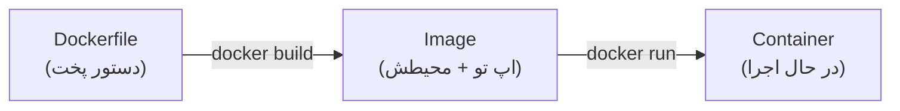

# فصل ۶ — اولین Dockerfile: بسته‌بندی اپ Node خودت

> 🎯 **هدف:** تا حالا ایمیج‌های *دیگران* رو اجرا کردی؛ حالا **ایمیج خودت** رو می‌سازی. یک اپ Node ساده رو قدم‌به‌قدم در Dockerfile بسته‌بندی می‌کنیم — خط به خط، با چرایی هر دستور.

---

## ۶.۱ — Dockerfile چیه؟

**Dockerfile = دستور پخت ایمیج تو.** یک فایل متنی که می‌گه: از چه پایه‌ای شروع کن، چه فایل‌هایی بیار، چه نصب‌هایی کن، و در آخر چه دستوری اجرا شه. داکر از رویش ایمیج می‌سازه:



(مثل فرق recipe و غذای آماده: Dockerfile دستوره، ایمیج غذای بسته‌بندی‌شده‌ی تکرارپذیره.)

## ۶.۲ — اپ نمونه: یک API مینیمال

یک پوشه بساز: `~/docker-playground/myapi` و دو فایل:

**`package.json`:**

```json
{
  "name": "myapi",
  "version": "1.0.0",
  "scripts": {
    "start": "node server.js"
  },
  "dependencies": {
    "express": "^5.0.0"
  }
}
```

**`server.js`:**

```js
const express = require("express");
const app = express();

app.get("/", (req, res) => {
  res.json({ message: "سلام از داخل کانتینر! 🐳", host: require("os").hostname() });
});

app.listen(3000, () => console.log("API روی پورت 3000 بالا آمد"));
```

## ۶.۳ — اولین Dockerfile (خط به خط)

فایل `Dockerfile` (بدون پسوند) در همین پوشه:

```dockerfile
FROM node:22-alpine

WORKDIR /app

COPY package.json ./

RUN npm install

COPY . .

EXPOSE 3000

CMD ["node", "server.js"]
```

خط به خط:

| دستور | کار | چرا |
|---|---|---|
| `FROM node:22-alpine` | ایمیج پایه — از اینجا شروع کن | Node 22 + لینوکس مینیمال؛ ما از صفر OS نمی‌سازیم! |
| `WORKDIR /app` | پوشه کاری داخل کانتینر | مثل `cd /app` — همه دستورات بعدی اونجا |
| `COPY package.json ./` | فقط فایل‌های وابستگی رو بیار | ⭐ راز کش — بخش ۶.۵ |
| `RUN npm install` | *حین build* اجرا کن (نصب وابستگی‌ها) | نتیجه در لایه ایمیج ذخیره می‌شه |
| `COPY . .` | حالا کل سورس رو بیار | آخر از همه تا با هر تغییر کد، نصب مجدد نشه! |
| `EXPOSE 3000` | مستندسازی: «این اپ روی ۳۰۰۰ گوش می‌ده» | ⚠️ پورت رو باز نمی‌کنه! فقط متادیتا — باز کردن با `-p` موقع run |
| `CMD ["node", "server.js"] | *موقع run* اجرا کن | پروسه اصلی کانتینر — هر کانتینر یک CMD |

> 🔑 مهم‌ترین تفاوت: **RUN** موقع build (در ایمیج ثبت می‌شه)، **CMD** موقع run (پروسه اصلی). فرقشون مثل «نصب برنامه» و «اجرا کردن برنامه» است.

## ۶.۴ — build و run: لحظه حقیقت

در Git Bash، داخل پوشه `myapi`:

```bash
$ docker build -t myapi:1.0 .
#        ↑ اسم:تگ خودم   ↑ مسیر build context (نقطه = همین پوشه)
[+] Building 23.4s (10/10) FINISHED
 => [4/6] RUN npm install              ← نصب وابستگی‌ها
 => [6/6] CMD ["node","server.js"]     ← لایه‌ها ساخته شدند
 => naming to docker.io/library/myapi:1.0

$ docker images | grep myapi
myapi   1.0   a1b2c3d4e5f6   10 seconds ago   132MB

$ docker run -d -p 3000:3000 --name api myapi:1.0

$ curl http://localhost:3000
{"message":"سلام از داخل کانتینر! 🐳","host":"a1b2c3d4e5f6"}
```

اپ **خودت** الان توی کانتینره: Node نصب، وابستگی‌ها نصب، و روی هر سیستمی همون‌طور اجرا می‌شه. `host` در پاسخ = ID کانتینره (hostname داخل ایزوله‌سازی).

## ۶.۵ — کش لایه‌ها: چرا ترتیب دستورها مهمه ⭐

سورس رو عوض کن (پیام API رو) و دوباره build بزن:

```bash
$ docker build -t myapi:1.0 .
=> [3/6] COPY package.json ./          ✓ CACHED
=> [4/6] RUN npm install               ✓ CACHED    ← 🎉 نصب نشد دوباره!
=> [5/6] COPY . .                      (جدید — چون سورس عوض شد)
```

چون `package.json` تغییر نکرده، لایه‌های نصب از کش اومدن — build از ۲۳ ثانیه به ۱ ثانیه. **قانون طلایی Dockerfile:** چیزهای به‌ندرت‌تغییرشونده بالا، چیزهای پرتغییرشونده (سورس) پایین. همون ایمیج که نوشتی درست همین کارو کرد.

## ۶.۶ — .dockerignore: مثل .gitignore

قبل از build، داکر کل پوشه رو به build context می‌فرسته — شامل `node_modules` (صد مگ!) و `.git`. فایل `.dockerignore` (کنار Dockerfile):

```
node_modules
.git
.env
*.log
Dockerfile
.dockerignore
```

بدون این، `COPY . .` همه چیز رو داخل ایمیج می‌ریزه (شامل node_modules لوکال که با مک/ویندوز ناسازگاره!) و `.env` هم لو می‌ره. **از همین امروز: هر پروژه‌ی داکری .dockerignore داره. همیشه.**

---

## ✅ جمع‌بندی فصل

- Dockerfile = دستور پخت؛ `docker build -t name:tag .` → ایمیج؛ `run` → کانتینر
- هفت دستور پایه: FROM / WORKDIR / COPY / RUN / EXPOSE / CMD (+ ENV از فصل قبل)
- RUN = حین build؛ CMD = پروسه حین run؛ EXPOSE فقط مستند
- **ترتیب = کش:** وابستگی‌ها اول، سورس آخر
- `.dockerignore` همیشه: node_modules و .env و .git

## 📝 تمرین فصل ۶

1. اپ `myapi` را دقیقاً مثل فصل بساز، build و run کن و با curl تست کن.
2. پیام JSON را عوض کن (مثلاً اسمت را اضافه کن) و دوباره build — ببین کدام لایه‌ها CACHED شدند.
3. `EXPOSE 3000` را از Dockerfile حذف کن، rebuild و بدون فلگ `-p` اجرا کن — curl کار می‌کند؟ چرا؟ (بعد برگردون!)
4. `.dockerignore` بساز و با `docker build` دوباره — تفاوت سرعت/اندازه را با `docker images` ببین.
5. چالش: یک Dockerfile برای یک فایل اسکریپت ساده بنویس (فقط `node script.js` که یک console.log دارد) — از ایمیش `node:22-alpine` و بدون npm install.

<details><summary>جواب تمرین ۳ و ۵</summary>

تمرین ۳: نه — curl fail می‌شود (connection refused). EXPOSE پورت را باز نمی‌کند؛ فقط مستندسازی است. کانتینر اجرا شده ولی از دنیای بیرون قابل دسترس نیست مگر با `-p`. (داخل کانتینر با exec و curl/wget می‌شد دیدش!)
تمرین ۵:

```dockerfile
FROM node:22-alpine
WORKDIR /app
COPY script.js .
CMD ["node", "script.js"]
```
</details>

➡️ **فصل بعد:** ایمیج را حرفه‌ای کن — multi-stage و کاهش چشمگیر حجم.
