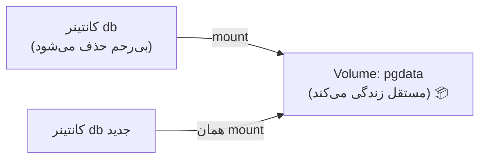

# فصل ۹ — Volumes: داده ماندگار و توسعه‌ی زنده

> 🎯 **هدف:** دو مشکل واقعی رو حل می‌کنیم: (۱) داده‌ی دیتابیس با حذف کانتینر می‌میره — named volume حلشه؛ (۲) در توسعه، هر تغییر کد نیاز به build دوباره داره — bind mount حلشه.

---

## ۹.۱ — داده‌ها و ماهیت یکبارمصرف کانتینرها (Disposable / Ephemeral)

اصل بنیادین در داکر: کانتینرها ماهیتاً موقتی و یکبارمصرف هستند و با حذف کانتینر، داده‌های نوشته‌شده درون آن از بین می‌رود. این موضوع را در عمل بررسی کنیم:

```bash
$ docker run -d --name db1 -e POSTGRES_PASSWORD=1 postgres:18
# چند رکورد درش ثبت کن...
$ docker rm -f db1           # حذف
$ docker run -d --name db2 -e POSTGRES_PASSWORD=1 postgres:18
# دیتابیس خالی! همه داده‌ها رفت.
```

داده‌ها داخل لایه‌ی نوشتنیِ کانتینر بودن که با `rm` حذف می‌شه. جواب داکر: **Volume** — یک فضای مدیریت‌شده‌ی بیرونِ کانتینر که بهش وصل می‌شه:



## ۹.۲ — Named Volume: داده‌ای که از death می‌ترسه نه

```bash
$ docker volume ls                     # لیست volumes
$ docker volume create pgdata          # ساخت دستی (معمولاً لازم نیست)
$ docker volume rm pgdata              # حذف (⚠️ داده برای همیشه می‌رود)
$ docker volume inspect pgdata         # کجا روی دیسک ذخیره شده؟
```

و استفاده در `run`:

```bash
$ docker run -d --name db \
  -e POSTGRES_PASSWORD=1 \
  -v pgdata:/var/lib/postgresql/data \
  postgres:18
#    ↑ اسم volume        ↑ مسیر داخل کانتینر
```

فرم `-v`: **`-v اسمvolume:مسیرکانتینر`** — یعنی «این مسیر داخل کانتینر را به این volume وصل کن». حالا `rm` کانتینر، داده رو نمی‌کشه: کانتینر جدید رو به همون volume وصل کن، دیتا برگرده.

توی compose (همون که فصل ۸ دیدی):

```yaml
services:
  db:
    image: postgres:18
    volumes:
      - pgdata:/var/lib/postgresql/data

volumes:
  pgdata:        # ← تعریف سطح بالای فایل
```

## ۹.۳ — Bind Mount: اتصال پوشه‌ای از سیستم میزبان به داخل کانتینر

فرقش با named volume: به جای فضای مدیریتی داکر، **یک پوشه واقعی از سیستم میزبان** رو وصل می‌کنی. فرم تشخیصی: چون به جای یک اسم ساده، *مسیر فایل سیستم* درج می‌شود:

```bash
$ docker run -d --name web -p 8080:80 \
  -v "$(pwd)/site":/usr/share/nginx/html \
  nginx
```

حالا فایل‌های پوشه‌ی `site` روی سیستم میزبان = محتوای سایت nginx. امتحانش:

```bash
$ echo "<h1>سلام از وب‌سرور داکر!</h1>" > ./site/index.html
$ curl http://localhost:8080
<h1>سلام از وب‌سرور داکر!</h1>     # بدون rebuild، بدون restart!
```

## ۹.۴ — در compose: bind mount برای توسعه ⭐

این الگو = قلب توسعه‌ی روزمره با داکر:

```yaml
services:
  api:
    build: .
    volumes:
      - ./src:/app/src          # پوشه سورس کد → داخل کانتینر
    environment:
      NODE_ENV: development
```

با `node --watch server.js` (یا nodemon) به عنوان CMD در توسعه: فایل رو ذخیره می‌کنی → داخل کانتینر همون لحظه تغییر کرده → سرور reload می‌شه. **تجربه‌ی hot-reload معمولی، ولی داخل کانتینر!**

> 💡 تفاوت‌های سرانگشتی:

| ویژگی | Named Volume | Bind Mount |
|---|---|---|
| فرم `-v` | `اسم:مسیر` | `/مسیر/سیستم:مسیر` |
| ماهیت | فضای ذخیره‌سازی تحت مدیریت داکر | پوشه واقعی روی سیستم‌عامل میزبان |
| بهترین کاربرد | داده‌های پایدار (دیتابیس) | محیط توسعه: سینک زنده سورس کد |
| وابستگی محیطی | کاملاً مستقل و قابل حمل | وابسته به ساختار مسیر سیستم میزبان |

## ۹.۵ — بکاپ: چون «ماندگار» = «باید بکاپش رو داشته باشم»

```bash
# خروجی گرفتن از محتوای volume (کانتینر موقت برای mount):
$ docker run --rm -v pgdata:/data -v "$PWD":/backup alpine \
  tar czf /backup/pgdata-backup.tar.gz /data

# بازگرداندن:
$ docker run --rm -v pgdata:/data -v "$PWD":/backup alpine \
  tar xzf /backup/pgdata-backup.tar.gz -C /
```

(الگوی رایج: کانتینر alpine موقتی که به volume و پوشه بکاپ mount می‌شه — `--rm` یعنی بعدش خودش می‌ره.)

## ۹.۶ — قانون‌های ماندگاری

1. **دیتابیس بدون volume = بمب ساعتی.** همیشه named volume
2. **سورس در توسعه = bind mount؛ در production = داخل ایمیج** (فصل ۷ — COPY)
3. `docker compose down` با volume ها کاری ندارد؛ `-v` = حذف (⚠️ سوال بپرس قبل از زدن!)
4. `docker system df` حجم volumes را نشان می‌دهد؛ `docker volume prune` = پاکسازی volume های بی‌صاحب

---

## ✅ جمع‌بندی فصل

- کانتینر حذف = داده لایه‌اش حذف؛ **volume = مستقل از کانتینر زندگی می‌کند**
- Named volume (`-v اسم:مسیر`) برای دیتای production؛ Bind mount (`-v /مسیر:مسیر`) برای توسعه
- bind mount = hot-reload واقعی داخل کانتینر با `--watch`/nodemon
- بکاپ با کانتینر موقت alpine؛ `down` امن، `down -v` خطرناک

## 📝 تمرین فصل ۹

1. Postgres با named volume بالا بیار (`pgdata`)، با psql یک جدول بساز و چند رکورد بزن؛ کانتینر را rm کن؛ دوباره با همان volume بالا بیاور — داده‌ها هست؟
2. bind mount روی nginx: یک پوشه با سه فایل html بساز و mount کن — بین مرورگر و ادیتور زندگی کن (تغییر → refresh).
3. بکاپ volume تمرین ۱ را با الگوی alpine بگیر و فایل tar را ببین.
4. در compose پروژه فصل ۸، به api یک bind mount برای src اضافه کن و `NODE_ENV=development` بگذار.
5. `docker system df` بزن — volumes چقدر گرفته‌اند؟

<details><summary>راهنمای تمرین ۱</summary>

```bash
docker run -d --name pg -e POSTGRES_PASSWORD=1 -v pgdata:/var/lib/postgresql/data postgres:18
psql "postgresql://postgres:1@localhost:5432/postgres" -c "CREATE TABLE t1(x int); INSERT INTO t1 VALUES (1),(2);"
docker rm -f pg
docker run -d --name pg -e POSTGRES_PASSWORD=1 -v pgdata:/var/lib/postgresql/data postgres:18
psql "postgresql://postgres:1@localhost:5432/postgres" -c "SELECT * FROM t1;"   # ← هنوز هست!
```
</details>

➡️ **فصل بعد:** شبکه‌ی کانتینرها — چرا در `DATABASE_URL` نوشتیم `@db:5432` و کار کرد؟!
