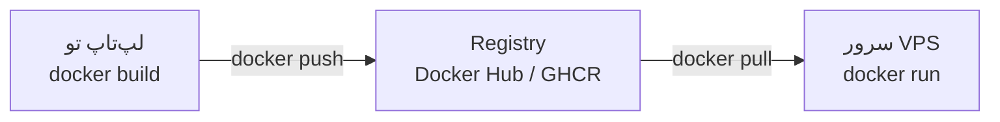

# فصل ۱۲ — push و دپلوی: از لپ‌تاپ به سرور

> 🎯 **هدف:** حلقه رو ببندیم: ایمیج ساخته‌شده رو به رجیستری push کن، روی یک VPS واقعی دپلوی کن، و نگهداری/امنیت پایه رو یاد بگیر. بعد از این فصل، «فول‌استک دپلوی‌شده» واقعاً معنا داره.

---

## ۱۲.۱ — چرخه توزیع: build → push → pull → run

همون مدل npm: پکیجت رو publish می‌کنی، هر کسی (حتی سرور) install می‌کنه:



## ۱۲.۲ — push به Docker Hub

```bash
$ docker login                      # با حساب کاربری رجیستری

$ docker build -t USERNAME/myapi:1.0 .          # ⚠️ اسم باید owner/name باشد!
$ docker tag myapi:1.0 USERNAME/myapi:1.0       # یا تگ مجدد ایمیج موجود

$ docker push USERNAME/myapi:1.0
```

(مشابه انتشار پکیج‌ها — ساختار `owner/name` الزامی است.) و روی هر سرور یا سیستمی در دنیا:

```bash
$ docker run -d -p 3000:3000 USERNAME/myapi:1.0
```

> 💡 **تگ‌گذاری معنادار:** `USERNAME/myapi:1.0` و `USERNAME/myapi:latest` — ارسال هر دو تگ توصیه می‌شود (latest برای دسترسی سریع، نسخه برای دقت و ثبات). دستور `docker tag` یک برچسب جدید روی همان ایمیج می‌زند و نیازی به بیلد مجدد نیست.

## ۱۲.۳ — گزینه‌ی مدرن: GHCR (رجیستری گیت‌هاب)

استفاده از GitHub Packages / GHCR به ویژه برای مخازن گیت‌هاب بسیار یکپارچه است:

```bash
$ echo $GITHUB_TOKEN | docker login ghcr.io -u USERNAME --password-stdin
$ docker tag myapi:1.0 ghcr.io/USERNAME/myapi:1.0
$ docker push ghcr.io/USERNAME/myapi:1.0
```

و خودکارسازی: در GitHub Actions، می‌توان یک پایپ‌لاین CI/CD نوشت که با هر Git Tag یا انتشار نسخه جدید، ایمیج را بیلد کرده و به GHCR ارسال کند.

## ۱۲.۴ — دپلوی روی VPS (سرور لینوکسی)

اتصال به سرور لینوکسی از طریق SSH:

```bash
# روی سرور — یک بار:
$ ssh root@203.0.113.10
# نصب داکر (اسکریپت رسمی):
curl -fsSL https://get.docker.com | sh
docker --version

# دپلوی:
$ docker pull ghcr.io/USERNAME/myapi:1.0
$ docker run -d --name api \
    -p 80:3000 \
    --restart unless-stopped \
    -e DATABASE_URL="..." \
    ghcr.io/USERNAME/myapi:1.0

$ curl http://203.0.113.10        # 🎉 اپلیکیشن روی سرور آماده پاسخگویی است!
```

- `--restart unless-stopped` = بعد از کرش یا ری‌استارت سرور، کانتینر خودبه‌خود روشن می‌شود (فصل ۳)
- `-p 80:3000` = پورت استاندارد ۸۰ وب به پورت کانتینر متصل می‌شود (یا در پشت Nginx قرار می‌گیرد)

### به‌روزرسانی نسخه (چرخه‌ی همیشگی):

```bash
# بعد از انتشار نسخه جدید:
$ docker pull ghcr.io/USERNAME/myapi:1.1
$ docker stop api && docker rm api
$ docker run -d --name api -p 80:3000 --restart unless-stopped \
    -e DATABASE_URL="..." ghcr.io/USERNAME/myapi:1.1
```

(این چرخه دستی برای شروع ساده‌ترین حالت است؛ در مراحل پیشرفته‌تر با ابزارهایی مثل Watchtower یا وب‌هوک‌ها خودکارسازی می‌شود.)

### استک با compose روی سرور:

اگر فایل compose آماده کرده‌اید، روی سرور به سادگی قابل اجراست:

```bash
$ git clone https://github.com/USERNAME/myproj.git && cd myproj
$ nano .env                        # تنظیم متغیرهای محیطی محیط پروداکشن
$ docker compose up -d --build
```

داده‌های دیتابیس در production هم با Volume داکر ذخیره می‌شوند — و فرآیند **بکاپ‌گیری** منظم (آموزش‌داده‌شده در فصل ۹) الزامی است.

## ۱۲.۵ — بهداشت سرور: پاکسازی

داکر روی سرور با نسخه‌های قدیمی ایمیج‌ها و کش بیلد ممکن است فضای دیسک را پر کند:

```bash
$ docker system df                 # گزارش فضای مصرفی داکر
$ docker system prune              # حذف کانتینرهای متوقف + شبکه‌های بلااستفاده + کش بیلد
$ docker system prune -a           # ⚠️ همراه با ایمیج‌های استفاده‌نشده (با احتیاط)
```

یک کار دوره‌ای یا cron job برای پاکسازی ایمیج‌های بی‌استفاده به سلامت سرور کمک شایانی می‌کند.

## ۱۲.۶ — امنیت پایه (چک‌لیست):

- [ ] **کلیدها و اطلاعات حساس در env، نه داخل ایمیج:** هرگز `ENV SECRET=...` در Dockerfile قرار نگیرد؛ همیشه از فایل‌های `.env`، ابزارهای مدیریت secret یا فلگ `-e` استفاده شود
- [ ] فایل‌های حساس `.env` هرگز به ایمیج یا مخزن گیت اضافه نشوند (تنظیم دقیق `.dockerignore` و `.gitignore`)
- [ ] استفاده از تگ‌های نسخه‌دار دقیق به جای `latest` در سرور پروداکشن
- [ ] دیتابیس بدون پورت پابلیک باز اجرا شود (فقط در شبکه داخلی داکر، مطابق فصل ۱۰)
- [ ] کانتینرها در صورت امکان با کاربر غیر روت اجرا شوند (`USER node` در Dockerfile برای پروژه‌های نود)
- [ ] ایمیج پایه را مرتب pull/بازسازی کن (آپدیت‌های امنیتی پایه)
- [ ] پورت‌های management (مثل ۲۳۷۵ داکر) بسته باشند

---

## ✅ جمع‌بندی فصل

- چرخه: `build -t owner/name:tag` → `push` → سرور `pull` → `run -d -p --restart`
- Docker Hub یا GHCR؛ تگ‌گذاری معنادار (نسخه + latest)
- دپلوی ساده VPS: داکر نصب → run با restart؛ استک‌ها با compose up
- `system prune` برای بهداشت فضا؛ امنیت: رازها با env، تگ دقیق، دیتابیس بی‌پورت

## 📝 تمرین فصل ۱۲

1. ایمیج myapi را با تگ‌های `1.0` و `latest` بساز و به Hub (یا GHCR) push کن.
2. ایمیج pushed را حذف از لوکال (`docker rmi`) و دوباره `docker run` — از رجیستری pull شد!
3. (اگر VPS داری ⭐) کل چرخه: pull و run و curl به IP سرور. (بدون VPS: شبیه‌سازی — pull روی سیستم خودت.)
4. `docker system df` و بعد `prune` — قبل و بعد را مقایسه کن.
5. چک‌لیست امنیتی را روی یک Dockerfile نمونه یا پروژه واقعی بررسی کن — چند مورد از موارد چک‌لیست رعایت شده است؟

<details><summary>نکته تمرین ۱</summary>

```bash
docker build -t USERNAME/myapi:1.0 -t USERNAME/myapi:latest .
docker push USERNAME/myapi:1.0
docker push USERNAME/myapi:latest
```
دو تگ = دو push (هر کدام یک اشاره‌گر به همان لایه‌ها — دومی تقریباً فوری است چون لایه‌ها آپلود شده‌اند).
</details>

➡️ **فصل آخر:** چیت‌شیت کامل و گلاساری — مرجع سریع دستورات داکر.
