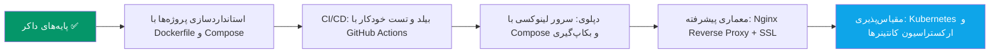

# فصل ۱۳ — چیت‌شیت، گلاساری و ارورهای کلاسیک

> 🎯 **هدف:** مرجع مرور سریع — چاپش کن کنار مانیتورت.

---

## ۱۳.۱ — چیت‌شیت دستورات

```bash
# ═══ ایمیج (فصل ۴) ═══
docker pull postgres:18              # دانلود (تگ دقیق!)
docker images / docker rmi      # لیست / حذف
docker build -t name:1.0 .           # ساخت از Dockerfile
docker history                  # لایه‌ها
docker system df / prune             # فضا / پاکسازی

# ═══ کانتینر (فصل ۳) ═══
docker run -d -p 8080:80 --name web nginx
#              ↑ میزبان:کانتینر    ↑ -e VAR=val متغیر
docker ps / docker ps -a             # در حال اجرا / همه
docker logs -f --tail 50 web         # لاگ زنده
docker stop/start/restart/rm web     # چرخه عمر
docker exec -it web bash             # ورود (alpine: sh)
docker cp web:/path ./               # کپی دوطرفه
docker container prune               # جاروی متوقف‌ها

# ═══ Compose (فصل ۸) ═══
docker compose up -d [--build]       # بالا بیاور
docker compose ps / logs -f api      # وضعیت / لاگ
docker compose exec api sh           # ورود به سرویس
docker compose down / down -v        # توقف / + حذف داده (⚠️)
docker compose config                # YAML نهایی با env

# ═══ داده (فصل ۹) ═══
docker volume ls / rm / inspect
-v pgdata:/var/lib/postgresql/data   # named (production)
-v ./src:/app/src                    # bind (توسعه)

# ═══ شبکه (فصل ۱۰) ═══
docker network ls / inspect <net>
اسم سرویس = hostname                 # کانتینر→کانتینر
localhost = فقط برای میزبان          # کانتینر→localhost غلط!

# ═══ توزیع (فصل ۱۲) ═══
docker login
docker tag myapi:1.0 user/myapi:1.0
docker push user/myapi:1.0
docker run -d --restart unless-stopped -p 80:3000 user/myapi:1.0
```

## ۱۳.۲ — هفت دستور Dockerfile

| دستور | کار |
|---|---|
| `FROM node:22-alpine` | ایمیج پایه (همیشه اول؛ alpine برای production) |
| `WORKDIR /app` | پوشه کاری داخل کانتینر |
| `COPY . .` / `COPY --from=x` | آوردن فایل‌ها / از مرحله دیگر |
| `RUN npm ci` | اجرا حین build (در ایمیج ثبت می‌شود) |
| `ENV NODE_ENV=production` | متغیر محیطی |
| `EXPOSE 3000` | مستندسازی (باز کردن واقعی با -p) |
| `CMD ["node","server.js"]` | پروژه اصلی حین run |

**قانون‌های Dockerfile:** dependency ها بالای سورس (کش!)؛ multi-stage برای production؛ .dockerignore همیشه؛ پاک‌سازی در همان RUN (`&&`).

## ۱۳.۳ — گلاساری فارسی–انگلیسی

| انگلیسی | فارسی | یک جمله |
|---|---|---|
| Container | کانتینر | نمونه‌ی در حال اجرای ایمیج — ایزوله و سبک |
| Image | ایمیج | قالب فقط‌خواندنی حاوی اپ و محیطش |
| Registry | رجیستری | انبار ایمیج‌ها (Docker Hub، GHCR) |
| Layer | لایه | پله‌ی فقط‌خواندنی ایمیج؛ پایه‌ی کش |
| Tag | تگ | نسخه‌ی ایمیج (`postgres:18`) |
| Dockerfile | — | دستور پخت ایمیج |
| Compose | — | تعریف چند سرویس در یک YAML |
| Volume | ولوم / حجم | فضای ماندگار مستقل از کانتینر |
| Bind Mount | اتصال پوشه | اتصال پوشه‌ای از سیستم میزبان به داخل کانتینر (برای توسعه) |
| Port Mapping | نگاشت پورت | `-p میزبان:کانتینر` |
| Build Context | زمینه build | پوشه‌ای که به build داده می‌شود (.) |
| Multi-stage | چند‌مرحله‌ای | build جدا از runtime برای ایمیج سبک |
| Daemon | دیمن | سرویس پس‌زمینه‌ی داکر (Engine) |
| Healthcheck | بررسی سلامت | «واقعاً» آماده است؟ (`pg_isready`) |
| WSL2 | — | لینوکس زیر Docker Desktop در ویندوز |

## ۱۳.۴ — دوازده ارور کلاسیک و ترجمه

| ارور | یعنی | علاج |
|---|---|---|
| `port is already allocated` | پورت میزبان اشغال | استفاده از پورت دیگر یا بستن پروسه اشغال‌کننده با `netstat` / `taskkill` |
| `Cannot connect to Docker daemon` | Engine خاموش | Docker Desktop یا سرویس Docker را اجرا کنید |
| `manifest unknown / pull access denied` | ایمیج/تگ غلط | نام و تگ را بررسی کنید؛ در صورت خصوصی بودن لاگین کنید (`docker login`) |
| `ECONNREFUSED` به دیتابیس از اپ کانتینری | استفاده از localhost داخل کانتینر | نام سرویس به عنوان هاست قرار گیرد: `@db:5432` (فصل ۱۰) |
| `P1001` در Prisma | db هنوز آماده نشده | `docker compose logs db` و صبر برای راه‌اندازی یا استفاده از healthcheck |
| `exec: bash: not found` | ایمیج مبتنی بر alpine است | استفاده از `sh` به جای `bash` |
| کانتینر بلافاصله Exited | پروسه اصلی متوقف شد | بررسی خروجی با `docker logs` (معمولاً ارور سینتکس یا متغیرهای محیطی) |
| داده‌ی دیتابیس پاک شد | volume تعریف نشده بود | تعریف و مانت Volume پایدار با `-v pgdata:...` (فصل ۹) |
| حجم ایمیج خیلی بزرگ شد | ابزارهای بیلد و فایل‌های اضافه داخل ایمیج مانده | Multi-stage build + حذف فایل‌های غیرضروری در `.dockerignore` (فصل ۷) |
| تغییر کد در پروژه اثر نکرد | ایمیج مجدداً بیلد نشده | اجرای `docker compose up -d --build` |
| `no space left on device` | دیسک پر شده | بررسی با `docker system df` و پاکسازی با `docker system prune` |
| خطای اجرای پکیج‌های نیتیو (node_modules) | کپی مستقیم پوشه لوکال هاست به لینوکس | نادیده گرفتن `node_modules` در `.dockerignore` و نصب داخل کانتینر (فصل ۶) |

## ۱۳.۵ — نقشه راه پس از این دوره



**سه توصیه‌ی پایانی برای تسلط کامل:**

1. **تمرین روی پروژه‌های واقعی:** در اولین فرصت، استک توسعه (مانند فصل ۱۱) را به پروژه‌های فعلی خود اضافه کنید و با ایجاد `compose.yaml` و `.env.example`، مدیریت دیتابیس و محیط را کانتینری کنید.
2. **استفاده مستمر از راهنمای خط فرمان:** تمام دستورات و سوییچ‌ها با دستورات `docker --help` و `docker compose --help` همواره در دسترس هستند و درک ساختار دستورات مهم‌تر از حفظ کردن آن‌هاست.
3. **مستندات رسمی داکر:** سایت [docs.docker.com](https://docs.docker.com) بهترین مرجع برای جزئیات فنی دقیق و قابلیت‌های پیشرفته‌تر است که با تسلط بر مفاهیم پایه‌ای این دوره، مطالعه آن بسیار آسان خواهد بود.

با تسلط بر این مفاهیم، توانایی بسته‌بندی، ایزوله‌سازی، تست و دپلوی پروژه‌های نرم‌افزاری به صورت استاندارد در داکر به دست آمده است. 🐳🚀
